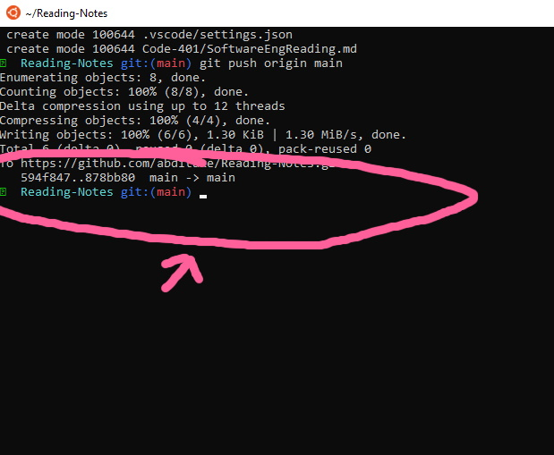
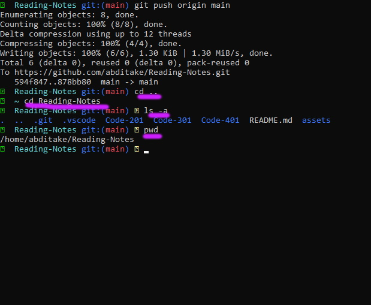

# The Command Line - What is it, how does it work and how do I get to one.
  
  - The command line is just an interface that allows you to enter text that executes commands.
  - something I didn't know was the `ls -l` command which allows you to list much more information like owner of the file, time modified, number of hard links to the file. 
  - this entire section talks about the linux command line through ubuntu but you can open your computers command line to all sorts of stuff as well just a little different.

  
# Basic Navigation - An introduction to the Linux directory system and how to get around it.
  - `pwd`: let you know where you currently are
  - `ls`: list files if you follow it with -a you can list all files in the current directory. 
  - `cd`: lets you go in and out of a directory. 
  - ### relative paths specify relation to root where as relative path specify location to where you currently are.
  

# More About Files - Find out some interesting characteristics of files and directories in a Linux environment.
- linux deals with hidden files by placing a dot in front of the filename. Something interesting about this I just recently started using nano more to edit hidden files like .profile and .bash. 
- you can wrap things in quotes to make sure the terminal knows its one command. 

# Manual Pages - Learn how to make the most of the Linux commands you are learning.

- The biggest takeaway I have from this is the ability to lookup an individual command.
-

# File Manipulation - How to make, remove, rename, copy and move files and directories.

Cheat Sheet - A quick reference for the main points covered in this tutorial.